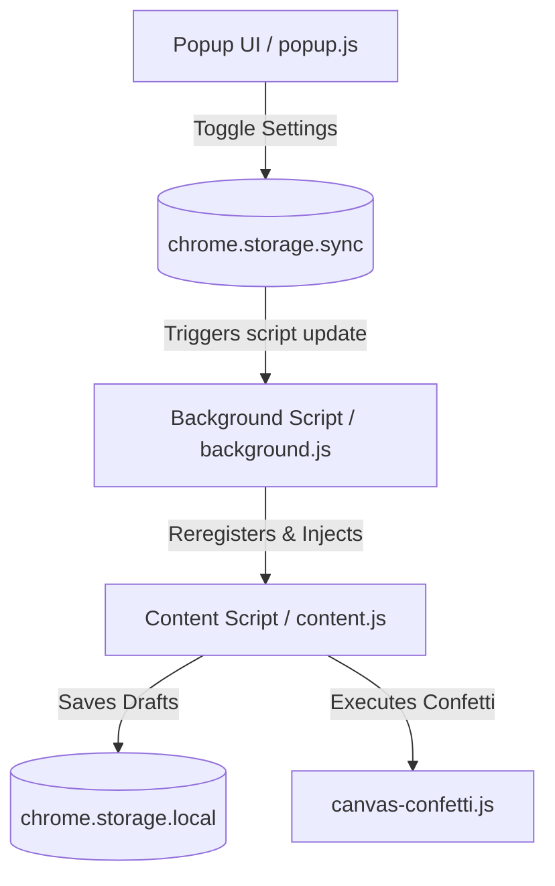

# AI Developer Handbook: Better Teacher Portal (`AGENTS.md`)

Welcome, AI Agent! This document is your comprehensive onboarding guide, technical architecture map, and code of conduct for working on **Better Teacher Portal**. Read this before suggesting or writing any code.

---

## 📖 Project Context & Overview

**Better Teacher Portal** is a lightweight, performance-focused Chrome Extension (Manifest V3) designed to dramatically improve the usability, styling, and data density of the student information school portal. The school portal runs on the Follett Aspen Student Information System (SIS), which is notoriously clunky, visually outdated, and difficult to navigate for teachers on a daily basis.

### The Users
- **Primary Audience**: Teachers and administrative staff in British Columbia, Canada.
- **Environment**: Often older, school-issued devices (e.g., Chromebooks, low-spec laptops) with slow CPUs and low screen resolutions. 
- **Core Needs**: High visual density, readable fonts, protection against losing typed comments, rapid click-saving for attendance, and smooth scrolling.

---

## 🛠️ Architecture & Core Components

Better Teacher Portal is built strictly with **Vanilla JS and Vanilla CSS** to guarantee sub-millisecond execution and a minimal memory footprint.



### File Map
- **[manifest.json](./manifest.json)**: Manifest V3 configuration. Uses `storage`, `scripting`, and `activeTab` permissions.
- **[background.js](./background.js)**: Manages content script registration and handles "Hot Injection" to apply features immediately without requiring a full tab reload.
- **[content.js](./content.js)**: The heart of the extension. Houses all DOM manipulation, custom styles, observer cycles, and sidebar injections.
- **[canvas-confetti.js](./canvas-confetti.js)**: A lightweight confetti library used for the Celebrate feature.
- **[popup.html](./popup.html) / [popup.js](./popup.js)**: Simple popup configuration to toggle settings.
- **[onboarding.html](./onboarding.html) / [onboarding.js](./onboarding.js)**: Welcome screen shown on first install.


---

## 🔍 Core Features & Technical Mechanics

### 1. Roster & Attendance Pages
* **Sticky Columns**: Elements on long tables scroll horizontally, but the student's name is locked to the left side (sticky).
* **Column Drag & Drop**: Enables column reordering on the main attendance grid. Column orders are saved in `chrome.storage.sync` under `myed_attendance_column_order` (legacy key) and loaded instantly.
* **Excused Attendances**: If a student is already marked Excused (`A-E`) in Class Attendance, the Absent (`A`) code button is automatically greyed out and disabled to prevent redundant clicks.
* **Always-Enabled Inputs**: Aspen usually locks attendance inputs after a save. A `MutationObserver` watches the `contentArea` and automatically strips the `disabled` attribute from the attendance button controls so teachers can make quick changes.

### 2. Trends Page Column Freezing
* **Layout Decoupling**: Aspen displays Trends pages in multiple decoupled tables. Better Teacher Portal locates the totals container `#div3`, moves it adjacent to student names, and synchronizes hovers and scroll alignments across elements.
* **Resize & Mutation Observers**: To prevent layout breakage when late assets load, a unified observer updates coordinates.

### 3. Draft Protection ("Better Grades")
* **Key Page**: `/textCommentEdit.do` (Comment editor iframe popup).
* **Sidebar UI**: Injects a clean sidebar containing font sizing selectors (`+` and `-` keys), status indicator logs, and synchronization status.
* **Saving States**: While typing in `textComment`, drafts are captured and stored in `chrome.storage.local` under `myed_comment_${studentId}` (legacy key). Drafts are safely cleared only when the user explicitly clicks the "Save" or "Cancel" buttons.
* **Auto-Resizing Window**: Measures the DOM height after styles are applied and dynamically calls `window.resizeTo(...)` to ensure the popup is fully visible without double scrollbars.
* **Red Pin Replacement**: Converts static red-pin images (`pin-red.gif`) into beautiful CSS-based "Posted" status badges on Gradebook columns.

---

## ⚠️ Critical Development Rules for AI Agents

When editing this codebase, you must adhere strictly to these engineering standards:

### 🚨 Rule 1: Guard Against Layout Thrashing
* **The Problem**: Reading CSS layout properties (e.g., `offsetWidth`, `getBoundingClientRect()`) immediately followed by writing styling properties (e.g., `style.left = ...`) in a loop forces the browser to recalculate layouts repeatedly, freezing slow school computers.
* **The Solution**: Always separate reading cycles from writing cycles. Utilize `requestAnimationFrame` for styling updates and cache layout calculations where possible.

### 🚨 Rule 2: Guard Extension Context Validity
* **The Problem**: Whenever the extension updates or is reloaded, the content script's execution context is orphaned. Trying to invoke chrome APIs (like `chrome.storage.sync.get` or `chrome.runtime.sendMessage`) will throw a runtime exception: *"Extension context invalidated"*.
* **The Solution**: Wrap chrome calls in the `isContextValid()` utility. Regularly check `chrome.runtime?.id` before executing callback routines.

```javascript
function isContextValid() {
  try {
    return typeof chrome !== 'undefined' && !!chrome.runtime?.id;
  } catch (e) {
    return false;
  }
}
```

### 🚨 Rule 3: Memory Leak Prevention (Clean Up Observers & Listeners)
* **The Problem**: Because Better Teacher Portal implements hot-injection and runs script sections repeatedly, multiple listeners and observers can pile up, consuming gigabytes of browser memory.
* **The Solution**: Store your observer and listener instances globally under unique properties on `window` and disconnect them *before* creating a new one.

```javascript
// Clean up previous instance before binding a new observer
if (window._myedObserver) window._myedObserver.disconnect();
window._myedObserver = observer;
```

### 🚨 Rule 4: No Frameworks or CSS Libraries
* Do not introduce React, Tailwind, jQuery, or other styling bundles. 
* All styling must be written in Vanilla CSS directly inside standard template literals in `content.js` or through isolated style nodes.

### 🚨 Rule 5: Draft Protection Integrity
* Under no circumstances should drafts be auto-cleared on a page unload, refresh, or session timeout. Only clear the local storage drafts when the DOM save button registers a successful click event.

### 🚨 Rule 6: Avoid "MyEd" and "MyEducation" Brand Terms
* **The Problem**: A government trademark takedown notice has been received regarding these terms.
* **The Solution**: Avoid using "MyEd" or "MyEducation" in UI text, onboarding materials, documentation, or new code/variable names. Use the extension's name **Better Teacher Portal** or refer to the platform generically as the "school portal" or "student information system". Existing keys containing these terms are preserved strictly for legacy compatibility and must not be altered in ways that break user storage.

---

## 🗺️ Roadmap & Planned Features

Feel free to pick up and build these planned enhancements:
- [ ] **Import/Export Roster Settings**: Allow teachers to share their custom dragged column templates.
- [ ] **Rich Comment Word-Counter**: Add a character and word counter directly into the Report Cards sidebar, warning users if they are approaching Aspen's character limit.
- [ ] **Dark Mode / Eye Strain Reducer**: Introduce a high-contrast eye-strain toggle in the popup for night-time grading.
- [ ] **Searchable Roster Filter**: Add a fast text-input field at the top of long grids to filter rows by student name in real-time.

---

*Remember, school administrators and busy teachers depend on this software to get their grading done efficiently. Keep your changes fast, safe, and beautifully simple.*
